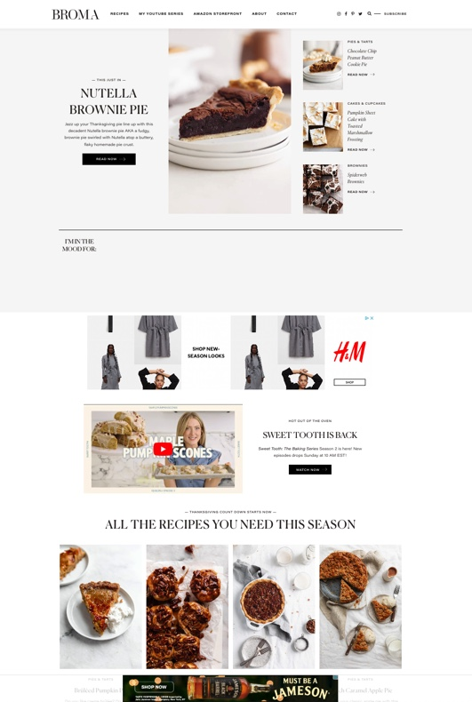
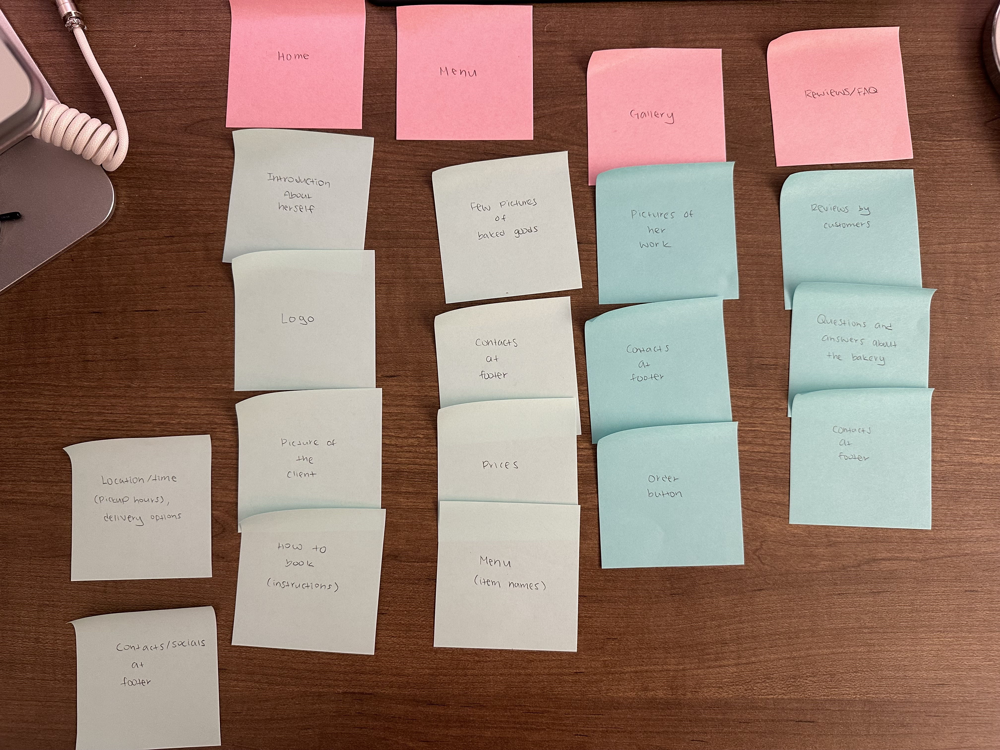
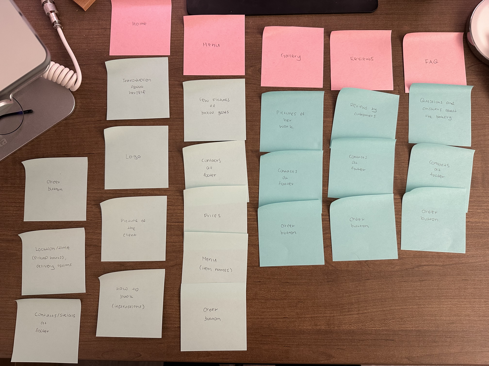
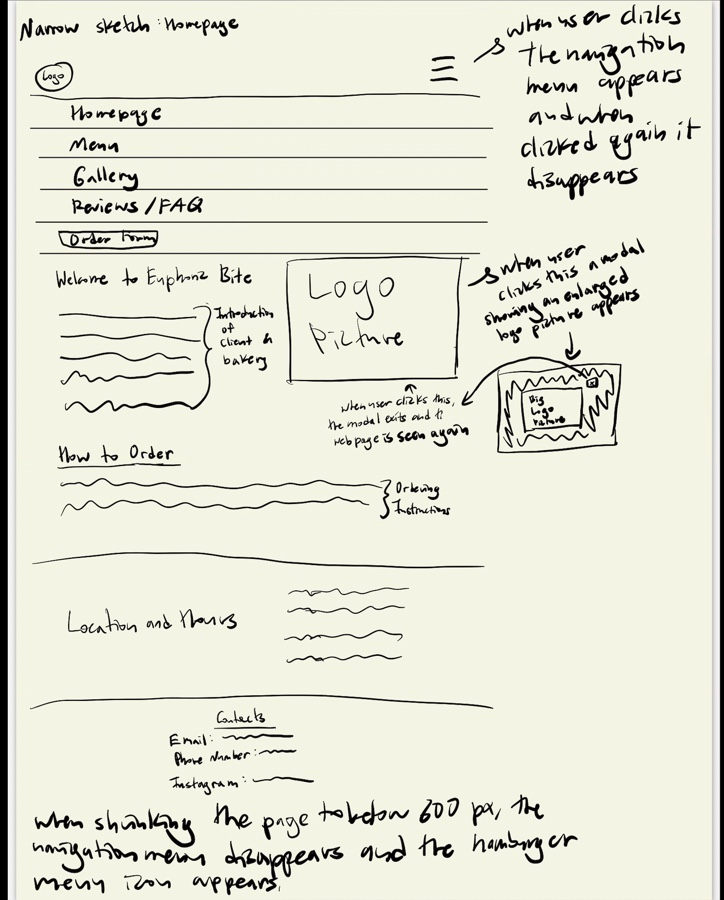
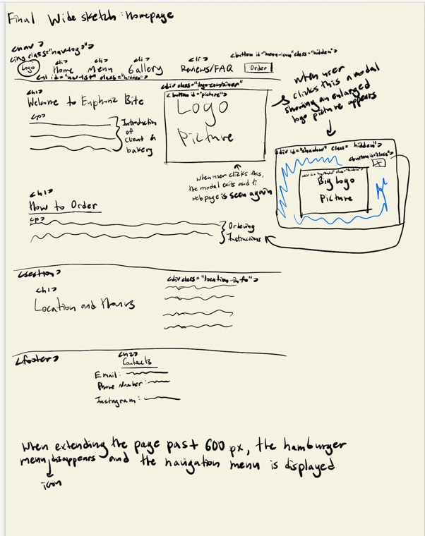

# Group Project: Design Journey

**For each milestone, complete only the sections that are labeled with that milestone.** Refine all sections before the final submission.

You are graded on your design process. If you later need to update your plan, **do not delete the original plan, leave it in place and append your new plan _below_ the original.** Then explain why you are changing your plan. Any time you update your plan, you're documenting your design process!

**Replace ALL _TODOs_ with your work.** (There should be no TODOs in the final submission.)

Be clear and concise in your writing. Bullets points are encouraged.

Place all design journey images inside the "design-plan" folder and then link them in Markdown so that they are visible in Markdown Preview.

**Everything, including images, must be visible in _Markdown: Open Preview_.** If it's not visible in the Markdown preview, then we can't grade it. We also can't give you partial credit either. **Please make sure your design journey should is easy to read for the grader;** in Markdown preview the question _and_ answer should have a blank line between them.

## Client (Milestone 1)

### Client Description (Milestone 1)
> Tell us about your client. Who is your client?
> Explain why your client meets the client rules in the project requirements.

Our client is Diaraye Jalloh. She is a home based bakery owner that has recently started a business and is looking for a website to showcase that business. This client meets the client rules because she is an off-campus local business.

### Client Questionnaire (Milestone 1)
> Develop a client questionnaire to learn more about your client and their goals.
> You may use the questionnaire below, you may modify the questionnaire below, or you may create your own.

1. Describe your organization and its purpose.

    My organization is a bakery (home based) and its purpose is to deliver tasty cupcakes that are not too tasty but enjoyable.

2. What makes your organization and its services special or unique?

    Community engagement makes my organization and its services unique because I do a lot of little bake sales in my community.

3. Why are you looking for a new website or updating your existing site?

    I want to give my clients an easy way to communicate with me and to show my business. I want to publicize and put my business out there.

4. Who do you want to visit your site? Who do you believe is your website's intended audience?

    My website's intended audience are people in my neighborhood and birthdays and people that need catering.

5. When visiting your site, what actions do you want your visitors to take?

    I want my website to be an easy access website in which everything needed is there and is comfortable to navigate

6. What are your goals for this site?

    My goals include having good communication with the customer and any questions that are frequently asked they can look at the website without having to contact me.

7. Is there a "feel" that you want for your site? Are there colors or imagery that you have in mind?
    Something that screams euphoric "pink" and "white" (colors don't matter too much) but something bright that will catch my client's attention.

8. What are your three favorite competitors or similar organizations' websites? Why?
    Fandi Treats for their truly unique designs of their cakes and cupcakes; La Creme De La Creme for their extravagant designs that are difficualt to recreate; and Kay's Cakes Bakery for the design of their website and how it attracts their customers.

### First Client Meeting Minutes/Notes (Milestone 1)
> Include your notes/minutes from your first meeting with your client.

- Has an example website for inspiration
- Wants a website for her bakery
- Wants a website to promote her bakery and for people to access her business easily
- Website's target audience are people in her hometown and other people that may want her baked goods for celebration
- Wants a simple, not complicated website
- Wants the website to communicate with her customers

### Client Website (Milestone 1)
> Tell us about the website that your client wants.
> Tell us the purpose of the website and what it is all about.
> Note: **If you are redesigning an existing website, give us the current URL and some screenshots of the current site.** (FireFox makes it easy to take a full screenshot of a page from the context menu (right click).)
> If you are redesigning an existing site, tell us how you plan to update the site significantly that meets the project's requirements.

The client wants a website that gives off a "euphoric vibe" in terms of it's display and exhibiting bright colors. The client would like the website to be accessible for anyone looking to casually book sweets and treats or for people hosting big events to book for catering.

### Client Goals (Milestone 1)
> Identify your client's goals for the website.
> What kind of website do they want? What are their goals for the site?
> There is no required number of goals. You need as many goals as necessary to reflect your client's desires.

- Create a website that she can use to communicate with her customers
- To advertise her business
- A website that is not to complex (simple)

### Client Website Scope (Milestone 1)
> We want your project to be successful! It needs to be ambitious, but not too large.
> A good rule-of-thumb is that you should have about 1 content-full page for each team member.
> Explain why the website you will create for your client isn't too small and isn't too big.
> Explain why you think it's the right size for this project.

Our proposed website is a perfect fit because we will be providing the client with exactly what she wants her clients to get out of when visiting the site. We plan to have a 3 page site: the Home page with an overall preview of who the baker is and the baker's goals and accomplishments; A page with a gallery to showcase the baker's works and let clients know what's available, as well as having a direct link at the bottom (will be a google form) that will allow the audience to book the baker or inquire about catering; and a FAQ page to address any questions or concerns the audience may have.

## Plan/Schedule (Milestone 1)
> Make a plan of when you will complete all parts of this assignment.
> This plan is for your team. There is no required format. Format it so that it works for you!
> Your plan should include when you will interview users and analyze their goals.
> Your plan should also include how and when you will assemble/create the sit's content.
> **Tip:** Your team should plan to work ahead. This project really isn't feasible to complete the night before a deadline.

We will meet this Sunday at 8:30pm (our usual meeting time) in order to discuss further about specifics surrounding the user interviews and our audience and we will plan the user interview questions and schedule a time to confuct the interviews. We will use the discussion time to analyze are audience's goals drawing conclusions form our interview notes and we will finalize a concrete idea of our site's audience. We will do the website exploration section exploring the example websites on our own. We will use our next Sunday meeting to plan out our website, starting with planning and organizing our sites content and then creating the card sorting iterations. We will also take this time to plan the navigation of the webpages and brainstorm the theme of our website. We will schedule another meeting in order to plan the interactivity of the website and create the layout exploration final sketches for our website. We will also schedule a meeting with our client for feedback and minutes. The follow up Sunday meeting will consist of working on going over our implementations of the website and we will discuss our plans for the rest of the week for dividing up the work for implementation. Finally, we will conduct the user testing and spend the last few days before the deadline finalizing our answers.

## Understanding Users (Milestone 2)

**Make the case for your decisions using concepts from class, as well as other design principles, theories, examples, and cases from outside of class.**

You can use bullet points and lists, or full paragraphs, or a combo, whichever is appropriate. The writing should be solid draft quality, but it doesn't have to be fancy.

### User Interview Questions (Milestone 2)
> Plan the user interview which you'll use to identify the goals of your site's audience.
> You may use the interview template below and revise it as much as you desire.

**User Interview Briefing & Consent:** "Hi, I am a student at Cornell University. I'm currently taking a class on web design and for a project, I am designing the website for (TODO: client's name). I'm trying to learn more about the people that might use this site. May I ask you a few questions? It will take about 10 minutes. You are free to quit at any time."

1. Please tell me a bit about yourself. You may omit any personal or private information.

2. How often do you buy baked goods?

3. When you're going on a bakery website what kind of features/things do you look for?

4. What influences you to choose one bakery over another?
...

n. What haven't I asked you today that you think would be valuable for me to know?

**After the interview:** "This was really helpful. Thank you so much for agreeing to speak with me today. Have a great day!"

### Interview Notes (Milestone 2)
> Interview at least 1 person for every member of your team from your audience.
> Take notes and include those notes here. Make sure to include a brief description of each interviewee.
> **Copy the interview questions above into each interviewee section below.**
> Take notes for each participant **inline** with the questions.

**Interviewee 1:**

Krislyn Michel; Freshman; From Brooklyn; Public Plociy Mjor; Dancer

1. How often do you buy baked goods?
Everytime she goes to the market; minimum every two weeks; usually from Paris Baguette for real baked goods; a cookie every day from dining hall
2. When you're going on a bakery website what kind of features/things do you look for?
Looks for websites based on events and how much they match what she's going for; looks for links for specific items; looks for variety of items
3. What influences you to choose one bakery over another?
the looks of the goods; depends on the event of how the company caters to that type of event; leans more twoards expensie look/feel of goods for quality purposes
4. What haven't I asked you today that you think would be valuable for me to know?
loves interactive maps and pictures that arent overly staged.

Very much into the vibes the website portrays.

**Interviewee 2:**

Deija-Lee Roldan; Pharmacy Technician; From Bronx, NY

1. How often do you buy baked goods?
Not often
2. When you're going on a bakery website what kind of features/things do you look for?
Looks for website to be appealing to the eye and grasp her attention; wants the website to be organized and able to help locate needs most efficiently
3. What influences you to choose one bakery over another?
The reviews; how easy the site is to naviagte; how much information the site provides; the photos the site provides
4. What haven't I asked you today that you think would be valuable for me to know?
The most important quality when choosing a specific site to work with would be their visuals.

**Interviewee 3:**

Jennifer Tapia-Diaz; From Bronx,NY; Political Science Major

1. How often do you buy baked goods?
Almost every month; for special occasions or someone's birthday
2. When you're going on a bakery website what kind of features/things do you look for?
Looks for a section with reviews; some of the work the baker has done; price lists
3. What influences you to choose one bakery over another?
The design and organization of the website; thinks catching someone's attention is very important
4. What haven't I asked you today that you think would be valuable for me to know?
n/a

### Goals (Milestone 2)
> Analyze your audience's goals from your notes above.
> List each goal below. There is no specific number of goals required for this, but you need enough to do the job (Hint: It's more than 1 and probably more than 2).

Goal 1: Design/ Appeal

- **Design Ideas and Choices** _How will you meet those goals in your design?_
  We will Design the Site to use warm and inviting colors like pastel shades, light pinks, and creamy whites. We will incorporate colors that evoke feelings of sweetness and freshness. We will also use photos of some of our cient's best works.

- **Rationale & Additional Notes** _Justify your decisions; additional notes._
  The color palette sets the tone and mood of the bakery website. Inviting colors such as the ones we chose create a cozy and appetizing atmosphere, making users more likely to explore your offerings. High-quality images showcase the products effectively, enticing users and encouraging them to make a purchase.

Goal 2: Price

- **Design Ideas and Choices** _How will you meet those goals in your design?_
  We will display a clear and easily understandable pricing structure. Use concise and straightforward language to describe each product or service.

- **Rationale & Additional Notes** _Justify your decisions; additional notes._
 Clarity in pricing eliminates confusion for visitors. Users should quickly grasp the cost of individual items or services without having to navigate through complex menus.

Goal 3: Quality
**Design Ideas and Choices** _How will you meet those goals in your design?_
   We will use, high-resolution images of products from the baker and incorporate a clean and elegant design that reflects the sophistication of the bakery we are trying to represent.

- **Rationale & Additional Notes** _Justify your decisions; additional notes._
 Quality imagery is essential for showcasing the details, textures, and freshness of your products. It establishes an immediate visual impression of the high standards the bakery maintains. Aslo, having a sophisitcated feel to the website  conveys professionalism and attention to detail, reflecting positively on the perceived quality of your bakery items.

### Audience (Milestone 2)
> Briefly explain your site's audience.
> Be specific and justify why this audience is a **cohesive** group with regard to your website.

The bakery website's primary audience comprises individuals residing in the local community and those seeking bakery services for special occasions. This group is cohesive due to their geographical proximity, emphasizing a sense of local connection and support. The website caters to individuals planning events, celebrations, or seeking baked goods for personal enjoyment, fostering a shared interest in event-based needs. The active community engagement of the bakery owner, Diaraye Jalloh, through local bake sales, extends to the online platform, enhancing the audience's cohesion. The local audience is likely to share common cultural backgrounds and taste preferences, allowing the website design to resonate with their cultural context. Designing with a focus on simplicity and easy navigation addresses the common accessibility needs of this cohesive group, ensuring that the website is tailored to meet their specific expectations and goals.

Identify three websites (preferably static websites) that exist today on the web to draw inspiration from. Please select websites that are similar to the website you wish to create.

## Website Design Exploration (Milestone 2)

Include two screenshots of the home page for each site: narrow and wide.

**We'll refer to these are your "example websites."**

1. <https://www.kayscakesbakery.com/>

    

    

2. <https://bromabakery.com/>

    

    

3. <https://shop.greyston.org/pages/about-greyston>

    

    

### Example Website 1 Review (Milestone 2)
> Review the website you identified above. (1 paragraph)
> In your review, include a discussion common design patterns and interactivity in the site.

This website includes a nav bar with a drop down menu for the menu tab, including a button saying "ORDER NOW" linking to a page with booking information. Common interactivity includes a hamburger menu with a side bar and icon when the screen is narrow  There are many flexboxes incorporated to highlight different sections in addition to a footer on the homepage. Interactivity also include more buttons leading to other webpages and those webpages also have buttons leading to other websites, and there is also a search bar, a cart logo which links to the customer's cart with their purchases, and a bar to enter their email to sign up to get updates. Additionally, since there are many different webpages and buttons with links to different webpages the logo in the navigation bar links to the home page so the user can find their way back if they get lost, enhancing the user experience. Additionally, there is a consistent pink and beige warm colored theme and similar typography and styling is used throughout the website.

### Example Website 2 Review (Milestone 2)
> Review the website you identified above. (1 paragraph)
> In your review, include a discussion common design patterns and interactivity in the site.

Common design patterns includes hamburger menu with a side bar and icon when the screen is narrow, and many side by side flexboxes with links to other pages. Most of the website content is centered and the website contains a footer with all the webpage links visible which goes across all the pages of the website, which provides consistency, and there are also social media logos with links to the website's social media accounts. In terms of interactivity, the website includes many pictures of desserts which act as a button which links to another webpage which an enlarged picture of this dessert and more information about it. This website also includes a logo which links back to the homepage, which is a common design pattern, and the typogrphy is bold and striking, and the ivory background with the contrasting dark colored fonts and black footer also gives the website a very clear and eye-catching look. However, there are hints of brown and warmer colors and the softer font type balances out this contrast.

### Example Website 3 Review (Milestone 2)
> Review the website you identified above. (1 paragraph)
> In your review, include a discussion common design patterns and interactivity in the site.

Common design patterns include a hamburger menu in which the icon appears in the narrow screen and leads to a drop down and a footer across all pages in the website with the different images and links to the company's social medias. Interactivity also inclues a drop down menu for different nav bar menu items including a search bar to search for specific information or aspects of the website. There is also a section to sign up for their email, which is also a common theme that I have noticed across all the different websites. The site is extremely loud and eye-catching as the fonts are big black and bold contrasting with a white background, and there are many flexboxes that are lined up horizontally that are colors of the rainbow. The website also uses different smiling pictures ond descriptions of their bakers, with their all - capitalized text and most of the website centered which enhances the user experience by highlighting the important information and maintaining the user's attention throughout the different pages of the website.

## Content Planning (Milestone 2)

Plan your site's content.

### Your Site's Planned Content (Milestone 2)
> List **all** the content you plan to include your website.
> You should list all types of content you planned to include (i.e. text, photos, images, etc.)
> Briefly summarize the content; do not include the content here.

- Gallery page with photos of the baked goods
- Background information about the baker (client) EX) why she started the business, about her
- Instructions on how to book
- Link to book (at the bottom of every page)
- Menu page with pictures for the baked goods, the names of the baked goods, price for each
- Contacts at the footer of every page
- General area/location
- FAQ page with questions and answers
- Reviews page

### Content Justification (Milestone 2)
> Explain (about a paragraph) why this content is the right content for your site's audience and how the content addresses their goals.

This content is right for our site's audience because they are looking for baked goods to order. The pages like menu notify the audience of price and items. The gallery page helps the audience know what the products look like.

## Information Architecture (Milestone 2)

### Content Organization (Milestone 2)
> Document your **iterations** of card sorting here. You must have at least 2 iterations of card sorting.
> Include photographic evidence of each iteration of card sorting **and** description of your thought process for each iteration.
> Please physically sort cards; please don't try and do this digitally.

The first iteration is split into 4 main categories: home, menu, gallery, review/FAQ. Home contains a short introduction about the client who is the owner of the bakery along with a picture of herself. It will also contain instructions on how to book an order and the location/time and delivery options. The menu page will contain few phhotos of the menu with the prices and the names. The gallery page will contain pictures of her work and an ordering button. The reviews/FAQs page will contain reviews by customers and questions and answers about the bakery. There will be contacts about the baker at the footer of every page.

The second iteration is split into 5 main categories: home, menu, gallery, review, and FAQ. The 'home' page will contain a short introduction about the client who is the owner of the bakery along with a picture of herself and a logo. It will also have instructions on how to book an order and the location/time and delivery options. The menu page will contain the prices, few representative pictures of the baked goods along with their prices and names. The gallery page will contain picutres of her work. The reviews page would have reviews by customers. The FAQ page would contain answers to the questions that customers may have about the bakery. Every page will contain the order button and contacts about the baker at the footer of every page.

### Final Content Organization (Milestone 2)
> Which iteration of card sorting will you use for your website?

We are planning to use the first card iteration.

> Explain how the final organization of content is appropriate for your site's audiences.

This organization makes sense for the audience since pages are organized into categories that a person looking to purchase baked goods from the site will find helpful and will look for.

### Navigation (Milestone 2)
> Please list the pages you will include in your website's navigation.

- Home
- Menu
- Gallery
- Reviews/FAQ

> Explain why the names of these pages make sense for your site's audience.

Home will contain a short information about the baker and instructions how to book. This will introduce the audience to the baker and inform them about the process of booking. The menu page will contain the list of items that they order and buy. The gallery contains the photo of her works which will give the audience a idea of the work and baked goods that she makes. The reviews/FAQ page will help the audience know if it's the type of a bakery they are looking for and answers to questions that they may have about the bakery.

## Visual Theme (Milestone 2)
> Discuss several (more than two) ideas about styling your site's theme. Explain why the theme ideas are appropriate for your target audiences. Note the theme you selected for your site and why it's appropriate for the audience and their goals.

Theme 1:

For an alternative theme, we might consider a more minimalist approach. The color scheme could involve muted pastels, creating a soft and sophisticated visual appeal. Shapes would be clean and modern, focusing on simplicity to provide a sleek and contemporary look. Typography would lean towards a modern sans-serif font, promoting readability and a sense of modernity. Imagery would involve high-quality, close-up shots of the baked goods, emphasizing their textures and details. This theme would be appropriate for an audience that appreciates a more modern and refined aesthetic. It caters to those who find beauty in simplicity and sophistication, potentially attracting customers looking for a high-end bakery experience.

Theme 2:

Another theme idea could revolve around a vintage-inspired design. The color palette might include warm tones such as beige, cream, and soft yellows, giving a nostalgic and comforting feel. Shapes would incorporate classic elements, and typography might involve script fonts or serif styles to evoke a sense of tradition and timelessness. Imagery would include vintage-style pictures, perhaps with a subtle sepia tone, capturing the essence of classic baking. This theme would be suitable for an audience that appreciates tradition and the charm of vintage aesthetics. It could attract customers seeking a bakery with a long-standing history or a timeless appeal, emphasizing the client's experience and dedication to the craft.

Theme 3 (The selected theme)
For our selected theme, we have chosen a color scheme dominated by pink and white with hints of brown, evoking a warm and inviting atmosphere. The choice of these colors aligns with the euphoric and delightful vibe that our client, Diaraye Jalloh, aims to convey through her bakery. Pink symbolizes sweetness and creativity, while white brings in a sense of purity and cleanliness, essential in the context of a bakery. The addition of hints of brown complements these colors, providing a touch of earthiness and warmth. In terms of shape, we opt for curved edges, giving a soft and approachable feel to the overall design. The typography we envision is fancy and appealing, with bolded words strategically used for contrast and emphasis. This choice ensures that important information, such as product names and key details, stands out. The imagery will consist of many different pictures of our client's cupcake creations, showcasing the variety and quality of her baked goods. Including the client's logo reinforces brand identity. This theme is appropriate as it reflects the warmth and creativity of a bakery, resonating with our target audience's desire for a visually pleasing and enjoyable experience.

## Design (Milestone 2)

Document your site's layout.

## Interactivity Brainstorm (Milestone 2)
> Using the audience goals you identified, brainstorm possible options for interactivity to enhance the functionality of the site while also assisting the audience with their goals.
> Briefly explain idea each idea and provide a brief rationale for how the interactivity enhances the site's functionality for the audience.
> Note: You may find it easier to sketch for brainstorming. That's fine too. Do whatever you need to do to explore your ideas.

- Hamburger menu: Users are able to click the hamburger menu icon which would open up pages. The pages would be displayed vertically and would be used in narrow screens.
- Click on "order" button that leads to google form: Users would press on the order button on the nav bar which would lead to a google form that they can use to order.
- Pop up of bigger photo when clicked on: The photo on the homepage would have a pop up of an enlarged photo when clicked on.
- Thumbnail gallery: The gallery page would be in a grid format. When the user presses the photo, they would be able to see the photos in a thumbnail gallery with the enlarged photos.

### Layout Exploration (Milestone 2)
> Iterate on your site's design through sketching.
> Sketch both the narrow and wide versions of the site.
> Here you are just exploring your layout ideas. You don't need to sketch every page.
> Include some of your interactivity ideas in your sketches.
> Provide an explanation for each sketch explaining the idea and the design patterns you are leveraging.

Narrow Sketch Homepage: I wanted to implement a hamburger drop down menu with an icon in order to display a common design pattern and I wanted to include a modal for the Logo in which the modal is an enlarged photo of the logo, because I realized it is very hard to see the words on the logo. In term of the design and structure of the page, I used the kays bakery website as my inspiration using a pattern of side by side flexbox and normal blocks and putting the introduction next to the Logo picture.

Wide Sketch Homepage: For the wide version, I wanted to contrast so I put the nav elements all next to each other and I made the hamburger icon go away for common design patterns and I wanted to include a modal for the Logo in which the modal is an enlarged photo of the logo, because I realized it is very hard to see the words on the logo. In term of the design and structure of the page, I used the kays bakery website as my inspiration using a pattern of side by side flexbox and normal blocks and putting the introduction next to the Logo picture, and the wide version also responsive so the sizes of the images and text grow bigger.

The wide version of menu would have a representative photo and the name of the items and price underneath the photo. The narrow version would be the same format except that it would be responsive and shrink the image and text accordingly to the screen size.

The wide gallery would have the photo layed out in a grid format. When clicked on a photo, the thumbnail gallery would appear which is the second sketch.

The narrow gallery would have the photos layed out vertically. The thumbnail gallery would appear when the photo is clicked.

The narrow version should have the text in the page fit to the screen without users having to scroll side to side to read the text.

The wide version would have all the text across the enteitre screen and centered.

### Final Design (Milestone 2)
> Include the final sketches for each of your pages.
> **Include your final interactivity in your sketches.** Include annotations to explain what happens when the user takes an action with your interactivity.
> The sketches must include enough detail that another 1300 student could implement them.
> Please provide an explanation for each sketch.

**Narrow Design:**

The hamburger menu will make the different site pages appear and close by pressing the button. The picutres and texts would be in a vertical format.

The images would be in a vertical format and the thumbnail gallery would appear when the photo is pressed. They would be able to exit out by pressing the x button.

Final Narrow Sketch: I aimed to incorporate a hamburger dropdown menu with an icon to showcase a widely recognized design pattern. Additionally, I included a modal for the logo, featuring an enlarged photo to address the difficulty of reading the words on the logo. Inspired by the design and structure of the Kay's Bakery website, I utilized a layout pattern involving side-by-side flexboxes and conventional blocks. This approach positioned the introduction alongside the logo picture, contributing to a visually appealing and user-friendly page structure.

Website Revision after user testing: Put the booking-section into a flex box and made it a different color including making the font white and adding styling such as a gray shadow. I also lined up that section with the intro section and also lined up the nav elemented with the logo and evenly spaced them.

The text will remain centered and be able to fit fully on the screen. There will also be a hamburger menu implemented in the nav bar which won't hide the text when it's pressed. The nav bar will show and hide the other pages of the site when pressed.

**Wide Design:**

There would be a representative photo of the category and the list of item names and prices would be underneath the photos.

The photos would be in a grid layout and when pressed, the thumbnail gallery would appear. The thumbnail gallery would enable users to see the enlarged photo. They would be able to exit out by pressing the x button.

Wide Sketch Homepage: To create a distinctive look for the wide version, I opted for a contrasting approach by aligning the navigation elements side by side and eliminating the hamburger icon, adhering to common design patterns. I introduced a modal for the logo, featuring an enlarged photo to address the legibility issue with the words on the logo. Drawing inspiration from the Kay's Bakery website, I employed a design pattern involving side-by-side flexboxes and conventional blocks for the page's structure. The introduction is strategically placed next to the logo picture for a cohesive layout. Moreover, the wide version is designed to be responsive, ensuring that both images and text dynamically scale for an optimal viewing experience.

All text will be centered throughout the page and the nav bar will have an order button on the nav bar that give users access to the order form.

### Design Rationale (Milestone 2)
> Explain why your design is appropriate for your audience.
> Specifically, why does your content organization, navigation, and site design/layout meet the goals of your users?
> How did you employ **design patterns** to improve the familiarity of the site for your audience?

This website is appropriate for the audience because the content adresses the needs of the audience. The vibrant pink and white give lighthearted and sweet vibes that are appropriate for a bakery. The different types of content are placed under pages that are named appropiately.  The "Home" page introduces the audience to the theme of the website, the owner of the company, and gives instructions on how to book with the them. The "Menu" page gives the audience a list of products that the company provides along with pictures and prices of the products. The "Gallery" page features pictures of works from the company. The "Reviews/FAQ" page adresses commonly asked questions which is convenient for the audience. This page also provides them with reviews so that they can better form their opinion on the company based on the experience of others.

## Interactivity Rationale (Milestone 2)
> Describe the purpose of your proposed interactivity.
> Provide a brief rationale explaining how your proposed interactivity addresses the goals of your site's audience and enhances their user experience.

Our interactivity consists of a hamburger menu, a thumbnail gallery, and an order button. The hamburger menu serves to accommodate users that are viewing the website with a narrow screen. The menu allows the navigation system to fit in the page without taking up a monstrous amount of space. A thumbnail gallery allows the audience to see pictures and enlarge them if interested. The order button will send the audience to a link that allows them to order products from the company.

## Interactivity Plan (Milestone 2)
> Now that you've designed your interactivity for your site, you need to plan how you will implement it.
> Describe how you will implement the interactivity. This should be a complete plan that another 1300 student could use to implement the interactivity.
> You should list the HTML elements, CSS classes, events, pseudocode, and the initial state.

## Client Feedback & Minutes (Milestone 2)
> You should meet with your client again to obtain feedback on your design.
> Provide a summary of the client's feedback and your meeting's minutes.

- Client loves the design; was exactly was she had in mind.
- Only feedback is to edit a few answers to the FAQ section.

15 minutes.

## User Testing (Final Submission)

**Conduct user testing with a minimum of 1 participant for every member of your team.**

### User Testing Tasks (Final Submission)
> Plan out your user testing tasks before doing your user testing.
> These must be actual user testing tasks.
> **Tasks are not questions!**

1. Locate how and where to contact the client. 

2. Navigate the website and find out how much it would cost for the order you want.

3. Locate where and how you would place the order you want.

4. Navigate the website  and find pictures of the products being sold

### Participant 1 (Final Submission)
> Using your notes from above, describe your user by answering the questions below.

1. Who is your user, e.g., where does the user come from, what is the user's job, characteristics, etc.?

    My user is college student from Plainview, Long Island and she loves pastries and sweets and has her fair share of knowledge on bakeries and their websites.

2. Does the user belong to your audience of the site?

    > If “No”, what’s your strategy of associating the user test results to your audience’s needs and wants? How can your re-design choices based on the user tests make a better fit for the audience?

    Yes.

### Participant 1 -- Testing Notes (Final Submission)
> When conducting user testing, you should take notes during the test.

- Was able to easily navigate across the different pages through the nav bar links
- Commented on how pretty the site was
- Took a bit of time to find the instructions to order
- However commented how there maybe should be more contrast between sections on the homepage as its it a bit harder to navigate
- Was very pleased with the nav bar design and styling and really liked how the colors matched the logos
- Found out the costs quit easily
- Located the contact information quickly

### Participant 2 (Final Submission)
> Using your notes from above, describe your user by answering the questions below.

1. Who is your user, e.g., where does the user come from, what is the user's job, characteristics, etc.?

The user is a college student. She comes from Queens, NY. She loves to host parties, such as a birthday parties and holiday parties.

2. Does the user belong to your audience of the site?

    > If “No”, what’s your strategy of associating the user test results to your audience’s needs and wants? How can your re-design choices based on the user tests make a better fit for the audience?

Yes

### Participant 2 -- Testing Notes (Final Submission)
> When conducting user testing, you should take notes during the test.

- Easily navigated and found the menu page
- Received feedback that the use of color pink for each category for menues helped find what she was looking for quickly since it stood out from the content of the menues itself.
- Some prices was a bit confusing.
- Overall said that the layout was nice and clear. Was easy to select and calculate the order she wanted.

### Participant 3 (Final Submission)
> Using your notes from above, describe your user by answering the questions below.

1. Who is your user, e.g., where does the user come from, what is the user's job, characteristics, etc.?

    The user is a student who is also an event coordinator for her club at school. The user is very organized and likes things be orderly and neat and likes to plan things out ahead of time.

2. Does the user belong to your audience of the site?

    > If “No”, what’s your strategy of associating the user test results to your audience’s needs and wants? How can your re-design choices based on the user tests make a better fit for the audience?

    Yes.

### Participant 3 -- Testing Notes (Final Submission)
> When conducting user testing, you should take notes during the test.

- User stated that her immediate go-to is the order-now button to get started.
- When needed more information was needed for the process went straight to the reviews/FAQs page.
- Stated the words might be spread out too far out on page.
- Information provided on page was quick and straight to the point.

### Participant 4 (Final Submission)
> Using your notes from above, describe your user by answering the questions below.

1. Who is your user, e.g., where does the user come from, what is the user's job, characteristics, etc.?

    The participant is a college student. They love to eat baked goods and candy.

2. Does the user belong to your audience of the site?

    > If “No”, what’s your strategy of associating the user test results to your audience’s needs and wants? How can your re-design choices based on the user tests make a better fit for the audience?

    Yes.

### Participant 4 -- Testing Notes (Final Submission)
> When conducting user testing, you should take notes during the test.

- User likes the visual aesthetic of the website
- User likes pop-up feature of logo on homnepage
- User quickly found the prices for products
- User easily accessed a way to place an order
- User was able to find extra information on the ordering process on the FAQ page
- User complimented the functiion of the navigation bar
- User also likes the functiob of the gallery page

## Website Revision Based on User Testing (Final Submission)
> What changes did you make to your design based on user testing?

- Made the menu more clear by adjusting the price tags.

## Grading (Final Submission)

### Collaborators (Final Submission)
> List any persons you collaborated with on this project.

We collaborated as a group (Sarah, Josephine, Jyna, and Davon) and with our client Diaraye Jalloh on this project.

### Reference Resources (Final Submission)
> Please cite any external resources you referenced in the creation of your project.
> (i.e. tutorials, W3Schools, StackOverflow, Mozilla, etc.)

<https://developer.mozilla.org/en-US/docs/Web/CSS>
